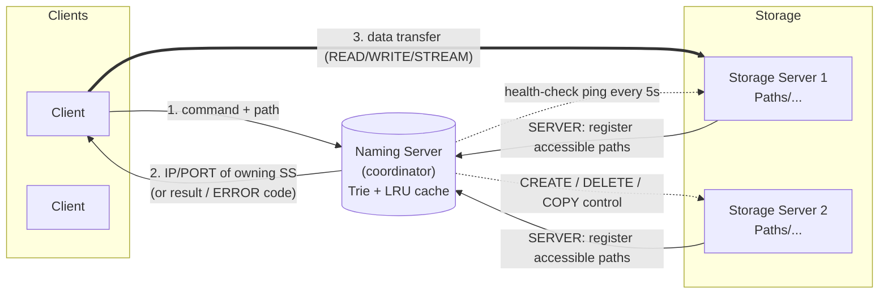

# Network File System (NFS)

**A distributed file system built from scratch in C** — a coordinator (*Naming Server*)
routes clients to the right *Storage Server*, where files actually live. Clients run
familiar operations (`READ`, `WRITE`, `CREATE`, `DELETE`, `COPY`, `LIST`, `STREAM`,
`GET_INFO`) over TCP, while the system transparently handles **path lookup, caching,
concurrency, asynchronous writes, audio streaming, and storage-server failure
detection**.


> Architecturally this mirrors real distributed storage (HDFS, classic NFS): a thin
> metadata/coordination tier in front of many data-bearing nodes, with the bulk data
> path going **directly** between client and storage node so the coordinator never
> becomes a bandwidth bottleneck.

---

## Table of contents

- [Highlights](#highlights)
- [Architecture](#architecture)
- [How a request flows](#how-a-request-flows)
- [Core data structures](#core-data-structures)
- [Supported operations](#supported-operations)
- [Repository layout](#repository-layout)
- [Build](#build)
- [Run](#run)
- [Example session](#example-session)
- [Wire protocol](#wire-protocol)
- [Concurrency &amp; fault tolerance](#concurrency--fault-tolerance)
- [Configuration](#configuration)
- [Known limitations](#known-limitations)
- [Roadmap](#roadmap)
- [Acknowledgements](#acknowledgements)

---

## Highlights

- **Three-tier architecture** — a single **Naming Server (NM)** coordinates many
  **Storage Servers (SS)** and **Clients**, decoupling *metadata/location* from *data*.
- **Direct client↔storage data path** — the NM only resolves *where* a file lives and
  returns `IP <ip> PORT <port>`; the client then talks straight to the storage server,
  so large transfers never pass through the coordinator.
- **Trie-based path resolution** — every known file path is indexed in a 256-ary trie
  for `O(path length)` lookup of the owning storage server.
- **LRU location cache** — a hash-map + doubly-linked-list LRU cache front-ends the
  trie for hot paths, with live hit/miss/eviction accounting.
- **Asynchronous writes** — writes are acknowledged immediately (`request has been
  accepted`) and completed in the background, with a `--SYNC` flag to force
  write-through semantics when durability matters.
- **Live audio streaming** — `STREAM` pipes a file straight from a storage server into
  the client's `ffplay`, demonstrating a streaming data path distinct from block reads.
- **Server-to-server `COPY`** — the naming server orchestrates a copy directly between
  two storage servers and updates its index/cache atomically.
- **Failure detection &amp; recovery** — a background health-check thread pings every
  storage server every 5 s and marks dead ones `down`; a restarted server
  **re-registers** and is automatically brought back online.
- **Reader/writer safety** — a path that is mid-write is reported `FILE IN USE` to
  readers instead of serving a torn file.
- **Concurrent by design** — the naming server spawns a thread per client; storage
  servers run independent naming-server-facing and client-facing listener threads.
- **Request logging** — all client requests and registrations are appended to
  `Log.txt`; sending `SIGTSTP` (Ctrl-Z) to the naming server dumps the log.

## Architecture



| Component | Role | Listens on |
|-----------|------|------------|
| **Naming Server** | Single coordinator. Owns the path→server index (trie), the LRU location cache, failure detection, and metadata operations (`CREATE`/`DELETE`/`COPY`/`LIST`). | `5354` (clients &amp; SS registration) |
| **Storage Server** | Stores real files under its `Paths/` directory. Serves bulk data to clients and executes control commands from the NM. | `7223` (clients), `5232` (naming server) |
| **Client** | Interactive CLI. Sends a command to the NM, then either reads the NM's result or connects directly to the resolved storage server for data. | — |

## How a request flows

**Read (`READ <path>`)**
1. Client → NM: `READ <path>`.
2. NM checks the path is not currently being written (else `ERROR 4 FILE IN USE`),
   resolves the owning storage server via **LRU cache → trie**, and replies
   `IP <ip> PORT <port>`.
3. Client connects **directly** to that storage server and receives the file as a
   stream of fixed-size `packet`s (`seq_num`, `total_chunks`, 256-byte `data`),
   followed by a final status code.

**Write (`WRITE <path> [--SYNC]`)**
1. Client → NM → resolves storage server (same as read).
2. Client streams lines to the storage server until it sends `$STOP`.
3. **Async (default):** the storage server replies `request has been accepted`,
   persists in the background, and later returns a completion code on a separate
   thread — the client is not blocked.
   **Sync (`--SYNC`):** the storage server completes the write before acknowledging.

**Stream (`STREAM <path>`)** — NM resolves the server; the client pipes the raw byte
stream into `ffplay -nodisp -autoexit -` for live audio playback.

**Create / Delete (`CREATE`, `DELETE`)** — handled NM-side: the NM forwards the
operation to the relevant storage server (which makes/removes the file or folder under
`Paths/`) and relays the resulting status code.

**Copy (`COPY <src> <dst>`)** — the NM reads `src` from its storage server and writes it
to `dst`'s storage server in a single orchestrated transfer, then updates the trie and
cache to point `dst` at its new home.

**List (`LIST`)** — the NM walks the trie and returns every accessible path.

## Core data structures

### Path trie (`trie.c`)
A 256-ary trie keyed on the raw bytes of a file path. Each node carries a
`StorageServer *` and an `isEndOfPath` marker, giving `O(path length)` insert / delete /
lookup and a natural prefix walk for `LIST`. The trie is the source of truth for
"which storage server owns this path."

### LRU location cache (`LRU.c`)
A fixed-capacity cache mapping `filepath → storage_server_number`, combining:
- a **hash map** (separate-chaining buckets) for `O(1)` average lookup, and
- a **doubly-linked list** ordered by recency, so the least-recently-used entry is
  evicted in `O(1)` when the cache is full.

It tracks `hits`, `misses`, and `evictions`, and is consulted before the trie on every
location query so repeated access to hot paths avoids a full trie walk.

## Supported operations

| Command | Resolved by | Data path | Semantics |
|---------|-------------|-----------|-----------|
| `READ <path>` | NM → SS lookup | client ↔ SS | Chunked file read; blocked with `FILE IN USE` during writes. |
| `WRITE <path> [--SYNC]` | NM → SS lookup | client ↔ SS | Async write by default; `--SYNC` forces write-through. Terminated by `$STOP`. |
| `STREAM <path>` | NM → SS lookup | client ↔ SS | Streams bytes to the client's `ffplay` (audio). |
| `GET_INFO <path>` | NM → SS lookup | client ↔ SS | Returns file metadata (size / permissions / timestamps). |
| `CREATE <file\|folder> <path>` | NM → SS | NM ↔ SS | Creates a file or directory under the SS `Paths/` root. |
| `DELETE <path>` | NM → SS | NM ↔ SS | Deletes a file or (recursively) a folder. |
| `COPY <src> <dst>` | NM-orchestrated | SS ↔ SS | Copies a path between storage servers; updates index + cache. |
| `LIST` | NM | NM ↔ client | Lists every registered path (trie walk). |
| `SERVER ...` | NM | SS → NM | Storage-server registration handshake (internal). |

## Repository layout

```
Network-File-System/
├── NamingServer/
│   ├── NamingServer.c      coordinator: accept loop, command dispatch,
│   │                       health-check thread, COPY orchestration, logging
│   ├── NamingServer.h      shared structs, ports/limits, trie & cache APIs
│   ├── trie.c              256-ary path → storage-server index
│   ├── LRU.c               hash-map + DLL LRU location cache
│   ├── ERROR.h             trie/cache error helpers
│   └── Makefile            builds the naming server
├── StorageServer/
│   ├── server.c            entry point; spawns NM-facing & client-facing threads
│   ├── ss_nm.c / SS_NM.h   registration + control ops (CREATE/DELETE/READ/WRITE)
│   ├── ss_client.c / SS_client.h   client data ops (READ/WRITE/STREAM/GET_INFO)
│   ├── headers.h           shared SS structs, ports, packet format
│   └── Paths/              the storage root served by this node (sample files)
└── Client/
    ├── client.c            interactive CLI; NM resolution + direct SS transfer
    └── erro_code.h         numeric error-code → message mapping
```

## Build

> **Platform:** Linux (the code uses POSIX sockets, `pthreads`, and `<dirent.h>`).
> `ffplay` (from FFmpeg) is required on the **client** host for `STREAM`.

```bash
# Naming Server (has a Makefile)
cd NamingServer
make                     # -> ./NamingServer   (compiles NamingServer.c trie.c LRU.c)

# Storage Server
cd ../StorageServer
gcc -Wall -pthread server.c ss_nm.c ss_client.c -o server

# Client
cd ../Client
gcc -Wall -pthread client.c -o client
```

## Run

Start the pieces in order. The naming server waits for **two** storage servers to
register before it begins serving clients (`INITIAL_STORAGE_SERVERS = 2`).

```bash
# 1) Naming server (listens on 5354)
cd NamingServer && ./NamingServer

# 2) Two or more storage servers — run each from its own directory that
#    contains a Paths/ folder.   Usage: ./server <NM_PORT> <NM_IP>
cd StorageServer && ./server 5354 127.0.0.1

# 3) One or more clients.        Usage: ./client <NM_PORT> <NM_IP>
cd Client && ./client 5354 127.0.0.1
```

> **Heads-up:** each storage server currently advertises a **hardcoded IP**
> (`my_ip` in `server.c`). On a single machine set it to `127.0.0.1`; across a LAN set
> it to that node's address before compiling. See [Known limitations](#known-limitations).

## Example session

```text
Enter command (read, write, delete, create, list, stream) and path: LIST
Naming Server:
./hello.txt
./vi.c
./jikh/hi.txt

Enter command ...: READ ./hello.txt
IP 127.0.0.1 PORT 7223
<file contents streamed in 256-byte chunks>
SUCCESS

Enter command ...: WRITE ./hello.txt
request has been accepted
hello world
this is appended asynchronously
$STOP
SUCCESS

Enter command ...: STREAM ./Ammaadi.mp3      # plays via ffplay
Enter command ...: EXIT
```

## Wire protocol

**Packet** (used for chunked `READ`/`WRITE`):

```c
typedef struct {
    int  seq_num;        // chunk index (-1 terminates a write stream)
    int  total_chunks;   // total chunks in this transfer
    char data[256];      // payload
} packet;
```

**Naming-server replies** are either a location (`IP <ip> PORT <port>`) for
data operations, or `ERROR <code>` / a result string for everything else.

**Error codes** (`Client/erro_code.h`):

| Code | Meaning | Code | Meaning |
|---:|---|---:|---|
| 0 | SUCCESS | 9 | WRITE FAILED |
| 1 | INVALID COMMAND | 10 | STREAM FAILED |
| 2 | PATH NOT FOUND | 11 | COPY FAILED |
| 3 | PERMISSION DENIED | 12 | GET_INFO FAILED |
| 4 | FILE IN USE | 13 | TIMEOUT |
| 5 | ALREADY EXISTS | 14 | BACKUP FAILED |
| 6 | DELETION FAILED | 15 | CONNECTION FAILED |
| 7 | CREATION FAILED | 16 | FILE NOT FOUND |
| 8 | READ FAILED | 17 | COULDN'T CONNECT |

## Concurrency &amp; fault tolerance

- **Thread-per-client.** The naming server's accept loop spawns a `pthread`
  (`process_client_requests`) for every client connection, so slow transfers don't
  block other clients.
- **Independent storage-server listeners.** Each storage server runs one thread for
  naming-server control traffic and one for client data traffic.
- **Asynchronous writes** are handled on a dedicated thread so the client is freed as
  soon as the request is accepted, while completion is reported later.
- **Health checks.** A background `Server_Status` thread pings every registered storage
  server every 5 seconds; an unreachable server is flagged `server_down` and skipped
  during resolution.
- **Recovery.** When a previously-registered server reconnects, the naming server
  recognises it by `ip:port`, clears the `down` flag, and logs *"Storage server coming
  back online."*
- **Write isolation.** Reads to a path being written return `FILE IN USE` rather than a
  partial file.

## Configuration

Key compile-time constants (edit the headers and rebuild):

| Constant | File | Default | Meaning |
|---|---|---:|---|
| `NM_PORT` | `NamingServer.h` | `5354` | Naming-server listen port |
| `CLIENT_PORT` | `SS_client.h` | `7223` | Storage-server port for clients |
| `NM_PORT` | `ss_nm.c` | `5232` | Storage-server port for the naming server |
| `MAX_STORAGE_SERVERS` | `NamingServer.h` | `20` | Max registered storage servers |
| `MAX_CLIENTS` | `NamingServer.h` | `200` | Max concurrent clients |
| `INITIAL_STORAGE_SERVERS` | `NamingServer.h` | `2` | Servers required before serving |
| `INITIAL_CASHE_SIZE` | `NamingServer.h` | `10` | LRU location-cache capacity |
| `CHUNK_SIZE` | `headers.h` | `256` | Transfer chunk size (bytes) |

## Known limitations

This started as a course project; the design is solid but a few rough edges remain
(documented honestly, since they are the obvious next things to fix):

- **Hardcoded storage-server IP.** `server.c` advertises a fixed `my_ip`; set it per
  host before compiling. A real deployment should auto-detect or take it as an argument.
- **Hardcoded ports and a fixed boot quorum.** Ports live in headers, and the naming
  server expects exactly `INITIAL_STORAGE_SERVERS` registrations at startup.
- **No authentication / permission enforcement.** `PERMISSION DENIED` exists in the
  error table but access control is not enforced.
- **Bounded capacities.** Servers (20), clients (200), and paths per server (100) are
  fixed-size arrays.
- **Trie cleanup on permanent failure.** A downed server is flagged but its paths are
  not yet pruned/re-replicated (the hook is stubbed).
- **A large sample `Ammaadi.mp3` is committed** for the `STREAM` demo; it should move to
  Git LFS or be fetched on demand.
- **Linux-only**, and there is some leftover commented/experimental code.

## Roadmap

- Configuration via CLI flags / a config file instead of recompiling.
- Replication with primary + backup storage servers and automatic failover
  (the `Backup_SS` field and `BACKUP FAILED` code are already reserved for this).
- Pruning and re-replicating a permanently-failed server's paths.
- Authentication and per-path access control.
- A `LIST <prefix>` and recursive metadata browse.
- Replace fixed-size arrays with dynamic structures; add an integration test harness.

## Acknowledgements

Built from scratch in C as a distributed-systems project at
**IIIT-Hyderabad**, implementing path resolution, caching, concurrency, asynchronous
I/O, streaming, and failure handling without any external file-system framework.
